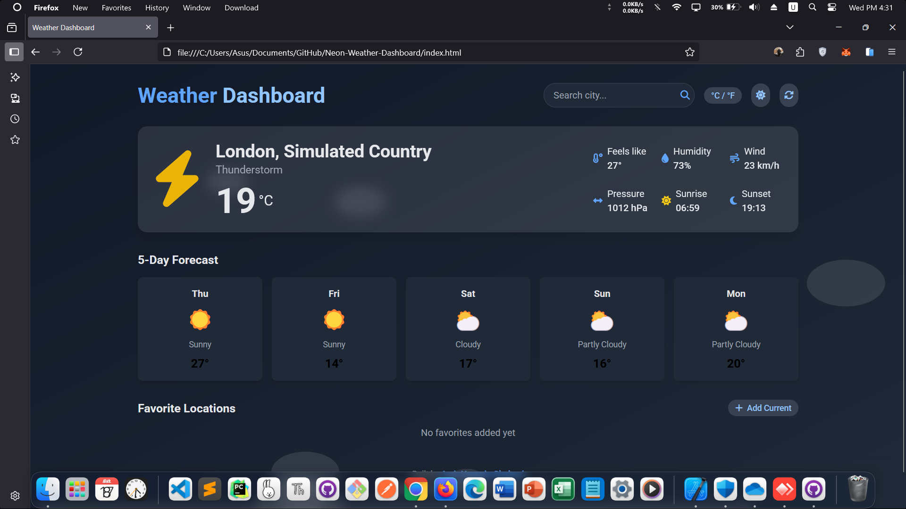

<!-- README.md -->

<a href="https://amirhosseingholami-dev.github.io/Neon-Weather-Dashboard/" target="_blank" style="text-decoration: none; color: inherit;">

<h3>Neon-Weather-Dashboard</h3>
</a>

A sleek, responsive weather dashboard with dark/light mode, 5-day forecast, favorites, and unit toggle (°C/°F). Built with Tailwind CSS, Font Awesome, and vanilla JavaScript. Fetches real-time data from OpenWeatherMap API. No frameworks — just clean, modern UI.

<a href="https://amirhosseingholami-dev.github.io/Neon-Weather-Dashboard/" target="_blank">🎯 Live demo</a> ·
<a href="https://github.com/AmirHosseinGholami-DEV/Neon-Weather-Dashboard/" target="_blank">💻 Source</a>

